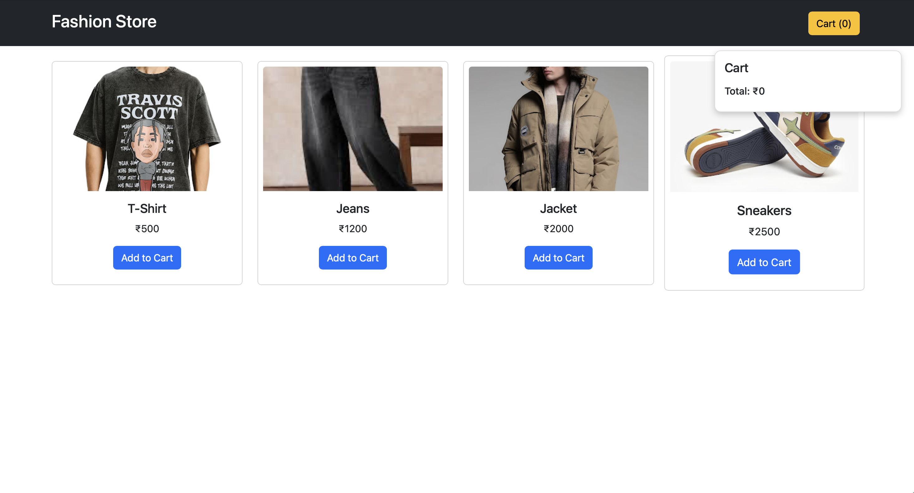

# Assignment 3 - Design a dynamic web app like fashion store / E- Commerce product using HTML, CSS & JS.

## 📌 Problem Statement
Design a dynamic web app like an e-commerce store using HTML, CSS & JS.

## 🎯 Objective
To build an interactive product listing with cart functionality.

## 🧠 Explanation
Products are displayed dynamically using JavaScript.
Users can add items to cart and view total price.

## 🛠️ Technologies Used
- HTML
- CSS
- JavaScript
- Bootstrap

## 📸 Output

## 🚀 How to Run
Open ecommerce.html in browser

## 📚 Learning Outcome
Learned DOM manipulation and dynamic UI updates.