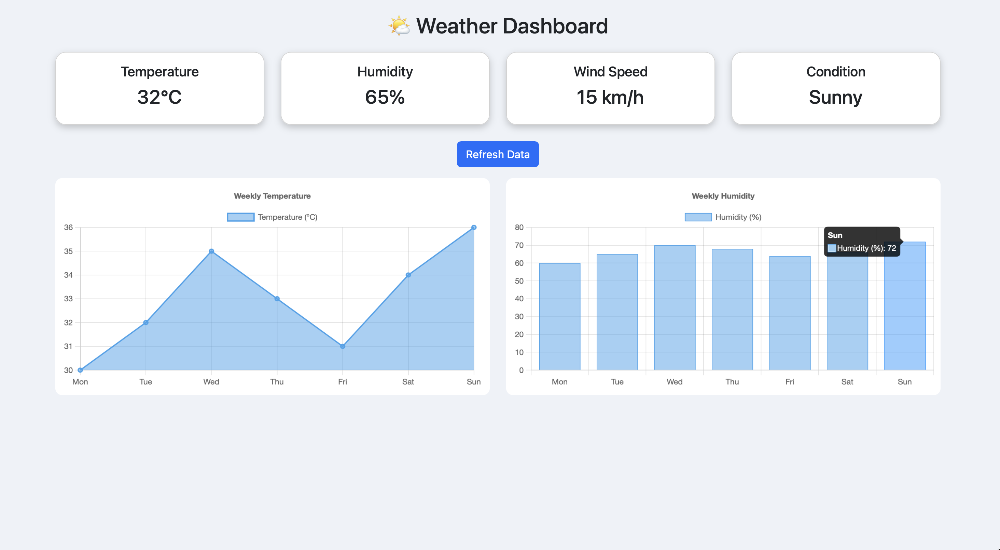

# Assignment 4 - Create any interactive data visualization dashboard for any real-life application like weather dashboard. Visualize data using charts and graphs

## 📌 Problem Statement
Create an interactive data visualization dashboard using charts.

## 🎯 Objective
To visualize weather data using Chart.js.

## 🧠 Explanation
This dashboard displays weather metrics and weekly trends using charts.
A refresh button updates the data dynamically.

## 🛠️ Technologies Used
- HTML
- CSS
- JavaScript
- Chart.js
- Bootstrap

## 📸 Output

## 🚀 How to Run
Open dashboard.html in browser

## 📚 Learning Outcome
Learned how to visualize data using charts and build interactive dashboards.